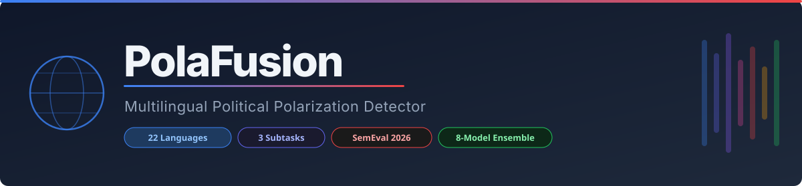
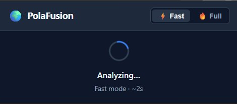
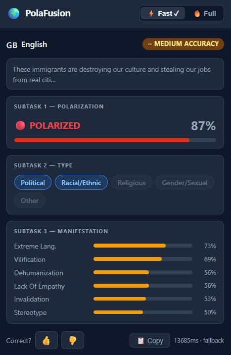
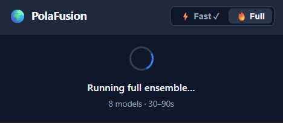
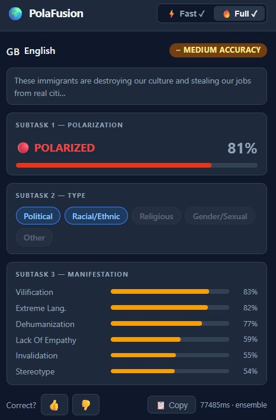
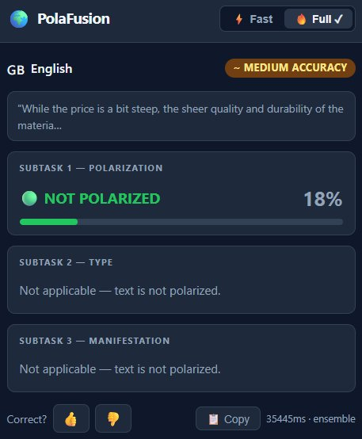
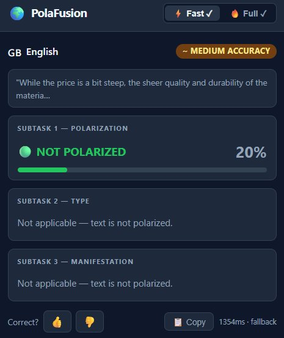

<div align="center">



# PolaFusion 🌍

### Multilingual Political Polarization Detector

*SemEval-2026 Task 9 — Detecting Polarization in Multilingual Social Media*

[](https://python.org)
[](https://fastapi.tiangolo.com)
[](extension/)
[](https://huggingface.co/EkcupKadakChai)
[](LICENSE)
[](docs/languages.md)

---

**PolaFusion** is a competition-grade multilingual polarization detection system built for SemEval-2026 Task 9. It detects *whether* text is politically polarized, *what type* of polarization it contains, and *how* the polarization manifests — across **22 languages** using an ensemble of fine-tuned transformer models.

[📖 Paper](#citation) · [🚀 Quick Start](#quick-start) · [🏗️ Architecture](#architecture) · [🌍 Languages](#supported-languages) · [📡 API](#api-reference) · [🔌 Extension](#chrome-extension)

</div>

---

## Table of Contents

- [Overview](#overview)
- [Quick Start](#quick-start)
- [Architecture](#architecture)
- [Supported Languages](#supported-languages)
- [Repository Structure](#repository-structure)
- [Backend Setup](#backend-setup)
- [Chrome Extension Setup](#chrome-extension-setup)
- [API Reference](#api-reference)
- [Model Details](#model-details)
- [Deployment](#deployment)
- [Citation](#citation)

---

## Screenshots

<table>
<tr>
  <td align="center" width="50%">
    
    <br/><sub><b>⚡ Fast mode — analyzing</b></sub>
  </td>
  <td align="center" width="50%">
    
    <br/><sub><b>⚡ Fast result — POLARIZED (87%) with type + manifestation breakdown</b></sub>
  </td>
</tr>
<tr>
  <td align="center" width="50%">
    
    <br/><sub><b>🔥 Full ensemble — running 8 models</b></sub>
  </td>
  <td align="center" width="50%">
    
    <br/><sub><b>🔥 Full ensemble result — POLARIZED (81%) · 77s</b></sub>
  </td>
</tr>
<tr>
  <td align="center" width="50%">
    
    <br/><sub><b>🔥 Full ensemble — NOT POLARIZED, ST2+ST3 gated out</b></sub>
  </td>
  <td align="center" width="50%">
    
    <br/><sub><b>⚡ Fast mode — NOT POLARIZED (20%) · 1.3s cached result</b></sub>
  </td>
</tr>
</table>

> **Note:** Fast (⚡) and Full (🔥) results are cached per session — switching modes shows the cached result instantly (✓ on the toggle button). Both modes called the live HuggingFace Spaces API.

---

## Overview

PolaFusion addresses three nested subtasks from SemEval-2026 Task 9:

| Subtask | Question | Output |
|---------|----------|--------|
| **ST1 — Detection** | Is this text polarized? | Binary: Polarized / Not Polarized |
| **ST2 — Type** | What kind of polarization? | Multi-label: Political, Racial/Ethnic, Religious, Gender/Sexual, Other |
| **ST3 — Manifestation** | How is it expressed? | Multi-label: Stereotype, Vilification, Dehumanization, Extreme Language, Lack of Empathy, Invalidation |

The system uses a **hierarchical gating** strategy: if ST1 predicts *not polarized*, ST2 and ST3 are skipped entirely, saving compute and reducing false positives.

### Two Inference Modes

| Mode | Models | Latency | Use Case |
|------|--------|---------|----------|
| ⚡ **Fast** | 1× mDeBERTa (fold 0) | ~2s | Real-time browsing |
| 🔥 **Full Ensemble** | 8× models (ST1), 6× models (ST2/ST3) | 30–90s | Research-grade accuracy |

---

## Quick Start

### Prerequisites

- Python 3.10+
- Git + Git LFS
- NVIDIA GPU recommended (CPU works, slower)

### 1. Clone

```bash
git clone https://github.com/EkcupKadakChai/polafusion.git
cd polafusion
```

### 2. Backend

```bash
cd backend
python -m venv venv
source venv/bin/activate        # Windows: venv\Scripts\activate
pip install -r requirements.txt
```

Create `.env` in the `backend/` folder:
```
HF_TOKEN=hf_your_token_here
```

Start the server:
```bash
uvicorn main:app --reload --port 8000
```

Test it:
```bash
curl -X POST http://127.0.0.1:8000/predict \
  -H "Content-Type: application/json" \
  -d '{"text": "These immigrants are destroying our culture.", "mode": "fallback"}'
```

### 3. Chrome Extension

1. Open Chrome → `chrome://extensions`
2. Enable **Developer mode**
3. Click **Load unpacked** → select the `extension/` folder
4. Select any text on a webpage → right-click → **🌍 Analyze with PolaFusion**

---

## Architecture

```
┌─────────────────────────────────────────────────────────────────┐
│                        Chrome Extension                          │
│  ┌──────────────┐   ┌────────────────┐   ┌──────────────────┐  │
│  │  content.js  │──▶│ background.js  │──▶│   popup/         │  │
│  │ (text select)│   │ (orchestrator) │   │ (result render)  │  │
│  └──────────────┘   └───────┬────────┘   └──────────────────┘  │
└──────────────────────────────┼──────────────────────────────────┘
                               │ POST /predict
                               ▼
┌─────────────────────────────────────────────────────────────────┐
│                        FastAPI Backend                           │
│                                                                  │
│  ┌─────────────┐    ┌──────────────┐    ┌───────────────────┐  │
│  │ lang_detect │───▶│   fallback   │───▶│  ST1 mDeBERTa     │  │
│  │  (lingua)   │    │  /ensemble   │    │  fold_0 only      │  │
│  └─────────────┘    └──────┬───────┘    └───────────────────┘  │
│                             │ ensemble                           │
│                             ▼                                    │
│  ┌──────────────────────────────────────────────────────────┐   │
│  │                    Ensemble Pipeline                      │   │
│  │                                                          │   │
│  │  ST1 (8 models)          ST2/ST3 (6 models each)         │   │
│  │  ├─ mDeBERTa fold 0–4   ├─ mDeBERTa fold 0–4            │   │
│  │  └─ XLM-R fold 0–2      └─ XLM-R full-trained           │   │
│  │     (w=1.67 each)           (w=5.0)                      │   │
│  └──────────────────────────────────────────────────────────┘   │
│                             │                                    │
│                    Hierarchical Gate                             │
│                    ST1=0 → skip ST2, ST3                        │
└─────────────────────────────────────────────────────────────────┘
                               │
                    ┌──────────▼──────────┐
                    │   HuggingFace Hub   │
                    │  (private repos)    │
                    │  semeval-deberta    │
                    │  semeval-3fold-xlmr │
                    │  semeval-xlmr-full  │
                    └─────────────────────┘
```

### Ensemble Weight Design

The ensemble weights are calibrated so each subtask's total voting mass equals **10.0**:

**ST1 — 8-Fold Gatekeeper**
```
5× mDeBERTa    weight=1.0 each  → mass=5.0
3× XLM-R 3fold weight=1.667 each→ mass=5.0
                          total  = 10.0
```

**ST2 / ST3 — 6-Fold Specialist**
```
5× mDeBERTa       weight=1.0 each → mass=5.0
1× XLM-R full     weight=5.0      → mass=5.0
                           total   = 10.0
```

---

## Supported Languages

| Code | Language | Flag | ST3 | Accuracy Tier |
|------|----------|------|-----|---------------|
| `hin` | Hindi | 🇮🇳 | ✅ | 🟢 High |
| `zho` | Chinese | 🇨🇳 | ✅ | 🟢 High |
| `urd` | Urdu | 🇵🇰 | ✅ | 🟢 High |
| `arb` | Arabic | 🇸🇦 | ✅ | 🟢 High |
| `khm` | Khmer | 🇰🇭 | ✅ | 🟢 High |
| `nep` | Nepali | 🇳🇵 | ✅ | 🟢 High |
| `eng` | English | 🇬🇧 | ✅ | 🟡 Medium |
| `deu` | German | 🇩🇪 | ✅ | 🟡 Medium |
| `spa` | Spanish | 🇪🇸 | ✅ | 🟡 Medium |
| `ben` | Bengali | 🇧🇩 | ✅ | 🟡 Medium |
| `pan` | Punjabi | 🇮🇳 | ✅ | 🟡 Medium |
| `tel` | Telugu | 🇮🇳 | ✅ | 🟡 Medium |
| `tur` | Turkish | 🇹🇷 | ✅ | 🟡 Medium |
| `swa` | Swahili | 🇹🇿 | ✅ | 🟡 Medium |
| `amh` | Amharic | 🇪🇹 | ✅ | 🟡 Medium |
| `mya` | Burmese | 🇲🇲 | ❌ | 🟡 Medium |
| `ita` | Italian | 🇮🇹 | ❌ | 🟡 Medium |
| `pol` | Polish | 🇵🇱 | ❌ | 🟡 Medium |
| `rus` | Russian | 🇷🇺 | ❌ | 🟡 Medium |
| `fas` | Persian | 🇮🇷 | ⚠️ | 🔴 Low |
| `hau` | Hausa | 🇳🇬 | ⚠️ | 🔴 Low |
| `ori` | Odia | 🇮🇳 | ⚠️ | 🔴 Low |

> **ST3 ❌** — Language excluded from ST3 competition data (Burmese, Italian, Polish, Russian)
> **ST3 ⚠️** — ST3 available but suppressed in UI due to low F1 scores (Persian F1=0.0, Hausa F1=0.14, Odia F1=0.03)

---

## Repository Structure

```
polafusion/
│
├── 📄 README.md                    ← You are here
├── 📄 LICENSE
├── 📄 .gitignore
│
├── 🖥️  backend/                    ← FastAPI server
│   ├── main.py                     App entry point, lifespan, CORS
│   ├── config.py                   Thresholds, labels, language matrix
│   ├── benchmark.py                Latency benchmarking script
│   ├── requirements.txt            Python dependencies
│   ├── Dockerfile                  HuggingFace Spaces deployment
│   │
│   ├── ml/                         Inference pipeline
│   │   ├── model_registry.py       HF repo path builders
│   │   ├── inference.py            Core model runner
│   │   ├── fallback.py             Single-model fast path
│   │   ├── ensemble.py             Multi-model weighted ensemble
│   │   └── lang_detect.py          Lingua-based language detection
│   │
│   ├── routes/                     API endpoints
│   │   ├── predict.py              POST /predict
│   │   ├── feedback.py             POST /feedback
│   │   └── health.py               GET /health
│   │
│   └── db/
│       └── database.py             SQLite feedback storage
│
├── 🔌 extension/                   ← Chrome Extension (MV3)
│   ├── manifest.json               Extension manifest
│   ├── background.js               Service worker
│   ├── content.js                  Page text selection + floating button
│   │
│   ├── popup/
│   │   ├── popup.html              Result UI shell
│   │   ├── popup.css               Dark theme styles
│   │   └── popup.js                Result rendering + per-mode cache
│   │
│   └── icons/
│       ├── icon16.png
│       ├── icon48.png
│       └── icon128.png
│
├── 📓 notebooks/                   ← Training & analysis notebooks
│   └── (SemEval training notebooks)
│
├── 📚 docs/                        ← Extended documentation
│   ├── languages.md                Per-language F1 scores
│   ├── ensemble.md                 Ensemble weight derivation
│   └── deployment.md               HuggingFace Spaces guide
│
└── 🎨 assets/
    └── banner.svg
```

---

## Backend Setup

### Environment Variables

| Variable | Required | Description |
|----------|----------|-------------|
| `HF_TOKEN` | ✅ Yes | HuggingFace token with read access to private model repos |

Create `backend/.env`:
```
HF_TOKEN=hf_your_token_here
```

> ⚠️ The `.env` file is in `.gitignore` — never commit it.

### Model Repositories (Private)

| Repo | Contents |
|------|----------|
| `EkcupKadakChai/semeval-deberta` | 5-fold mDeBERTa-v3-base, all 3 subtasks, augmented |
| `EkcupKadakChai/semeval-3fold-xlmr` | 3-fold XLM-R Large, all 3 subtasks, augmented |
| `EkcupKadakChai/semeval-xlmr-full-trained` | Fully-trained XLM-R, ST2 + ST3 only |

### Decision Thresholds

| Subtask | Threshold | Rationale |
|---------|-----------|-----------|
| ST1 | 0.50 | Standard binary |
| ST2 | 0.35 | Lower → catch more type labels |
| ST3 | 0.30 | Lower → catch more manifestations |

### Running Locally

```bash
cd backend
uvicorn main:app --reload --port 8000
```

### Benchmarking

```bash
# Against live server
python benchmark.py --http http://127.0.0.1:8000

# Direct inference (no server needed)
python benchmark.py
```

---

## Chrome Extension Setup

### Load in Chrome

1. Open `chrome://extensions`
2. Toggle **Developer mode** ON
3. Click **Load unpacked** → select the `extension/` folder

### How to Use

| Method | How |
|--------|-----|
| Right-click menu | Select text → right-click → **🌍 Analyze with PolaFusion** |
| Keyboard shortcut | Select text → press `Alt+P` |
| Floating button | Select 20+ characters → click the **🌍 Analyze** button that appears |

### Per-Mode Caching

The extension caches results per mode within a session:
- Switching ⚡ Fast ↔ 🔥 Full shows the cached result **instantly** if already computed
- A ✓ checkmark appears on the toggle button when a mode's result is cached
- Selecting **new text** clears both caches

### Updating the API URL for Production

In `extension/background.js` and `extension/popup/popup.js`, change line 4:
```javascript
const API_BASE = "https://your-space.hf.space";  // your deployed URL
```

---

## API Reference

### `POST /predict`

Analyze text for polarization.

**Request**
```json
{
  "text": "These immigrants are destroying our culture.",
  "mode": "fallback"
}
```

| Field | Type | Values | Default |
|-------|------|--------|---------|
| `text` | string | Min 20 chars | required |
| `mode` | string | `"fallback"` \| `"ensemble"` | `"fallback"` |

**Response**
```json
{
  "detected_language": "eng",
  "language_name": "English",
  "language_flag": "🇬🇧",
  "confidence_tier": "medium",
  "subtask1": {
    "label": 1,
    "probability": 0.89,
    "threshold": 0.5
  },
  "subtask2": {
    "gated_out": false,
    "labels": {
      "political":     { "score": 0.74, "predicted": 1 },
      "racial/ethnic": { "score": 0.51, "predicted": 1 },
      "religious":     { "score": 0.12, "predicted": 0 },
      "gender/sexual": { "score": 0.08, "predicted": 0 },
      "other":         { "score": 0.21, "predicted": 0 }
    }
  },
  "subtask3": {
    "available": true,
    "gated_out": false,
    "suppressed": false,
    "labels": {
      "vilification":    { "score": 0.81, "predicted": 1 },
      "extreme_language":{ "score": 0.67, "predicted": 1 },
      "stereotype":      { "score": 0.34, "predicted": 1 },
      "dehumanization":  { "score": 0.22, "predicted": 0 },
      "lack_of_empathy": { "score": 0.19, "predicted": 0 },
      "invalidation":    { "score": 0.11, "predicted": 0 }
    }
  },
  "mode_used": "fallback",
  "processing_ms": 1840,
  "text_preview": "These immigrants are destroying our culture."
}
```

**Error Responses**

| Code | Meaning |
|------|---------|
| 400 | Text too short (< 20 chars) |
| 422 | Invalid request body |
| 500 | Model inference error |

---

### `GET /health`

```json
{
  "status": "ok",
  "device": "cuda",
  "modes_available": ["fallback", "ensemble"],
  "languages_supported": 22
}
```

---

### `POST /feedback`

Submit correctness feedback for a prediction.

```json
{
  "text": "These immigrants...",
  "lang_code": "eng",
  "mode_used": "fallback",
  "st1_predicted": 1,
  "st1_correct": 1
}
```

---

## Model Details

### Base Models

| Model | Parameters | Strengths |
|-------|-----------|----------|
| `microsoft/mdeberta-v3-base` | 278M | Strong multilingual NLU, augmentation-robust |
| `xlm-roberta-large` | 560M | Wide language coverage, high-resource excellence |

### Training Strategy

- **5-fold cross-validation** for mDeBERTa across all 3 subtasks
- **3-fold cross-validation** for XLM-R (ST1 ensemble)
- **Full-data training** for XLM-R (ST2 + ST3 specialist)
- **Data augmentation** applied to minority classes in all folds
- Augmentation plans computed per-language based on macro-F1 aware analysis

### HuggingFace Repo Structure

```
semeval-deberta/
└── subtask_{1,2,3}_5fold_mdeberta_aug/
    └── subtask{N}_final_models/
        └── fold_{0..4}/

semeval-3fold-xlmr/
└── subtask_{1,2,3}_xlmr_3fold_aug/
    └── subtask{N}_xlmr_large_final_models/
        └── fold_{0..2}/

semeval-xlmr-full-trained/
├── subtask_2_xlmr_full_trained_aug/
│   └── full_train_model_task2/
└── subtask_3_xlmr_full_trained_aug/
    └── full_train_model_task3/
```

---

## Deployment

### HuggingFace Spaces (Docker)

```bash
git clone https://huggingface.co/spaces/EkcupKadakChai/polafusion-api
cd polafusion-api
cp -r path/to/polafusion/backend/* .
git add .
git commit -m "Deploy PolaFusion API"
git push
```

Set the secret in Space Settings → Variables and secrets:
```
HF_TOKEN = hf_your_token_here
```

### Environment Notes

| Environment | Python | torch | Notes |
|-------------|--------|-------|-------|
| Local Windows | 3.13 | 2.6.0+cu124 | GPU recommended |
| HuggingFace Spaces | 3.10 | via Dockerfile | CPU Basic (free tier) |

---

## Citation

If you use PolaFusion in your research, please cite:

```bibtex
@inproceedings{polafusion-semeval2026,
  title     = {PolaFusion: Multilingual Polarization Detection via Weighted
               Transformer Ensembles for SemEval-2026 Task 9},
  author    = {EkcupKadakChai},
  booktitle = {Proceedings of the 20th International Workshop on Semantic
               Evaluation (SemEval-2026)},
  year      = {2026},
  publisher = {Association for Computational Linguistics},
  note      = {System description paper for Task 9:
               Detecting Polarization in Multilingual Social Media}
}
```

### Task Citation

```bibtex
@inproceedings{semeval2026-task9,
  title     = {SemEval-2026 Task 9: Detecting Polarization in
               Multilingual Social Media},
  booktitle = {Proceedings of the 20th International Workshop on
               Semantic Evaluation (SemEval-2026)},
  year      = {2026},
  publisher = {Association for Computational Linguistics}
}
```

### Model Citations

```bibtex
@article{he2021deberta,
  title   = {DeBERTa: Decoding-enhanced BERT with Disentangled Attention},
  author  = {He, Pengcheng and Liu, Xiaodong and Gao, Jianfeng and Chen, Weizhu},
  journal = {ICLR},
  year    = {2021}
}

@article{conneau2019unsupervised,
  title   = {Unsupervised Cross-lingual Representation Learning at Scale},
  author  = {Conneau, Alexis and others},
  journal = {ACL},
  year    = {2020}
}
```

---

## License

This project is licensed under the MIT License — see [LICENSE](LICENSE) for details.

Model weights are private and available only for research purposes.

---

<div align="center">

Built for **SemEval-2026 Task 9** · Powered by 🤗 HuggingFace Transformers

</div>
